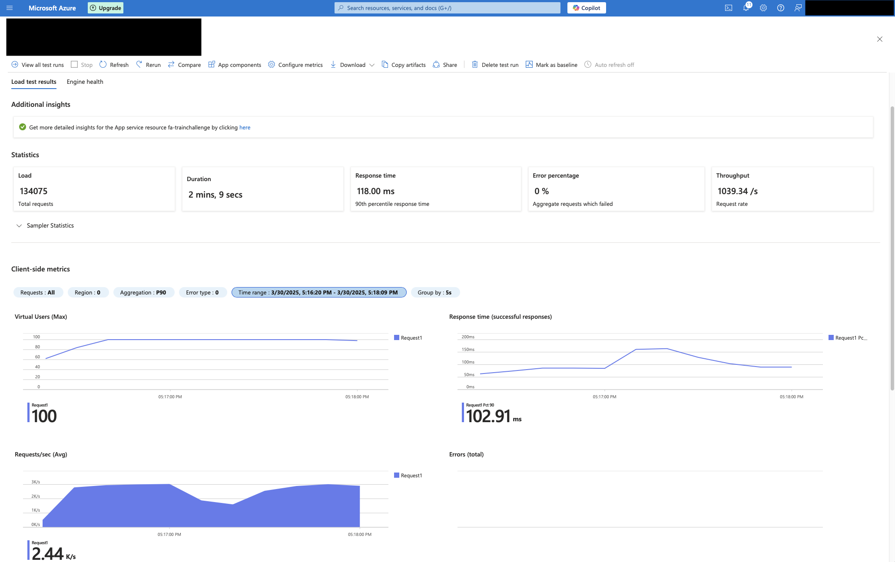

## Train Challenge

### Overview
This repository contains code for a challenge to create a scalable, production-grade API for calculating the nearest train station to a user for different train networks. In this demo, only SEPTA Regional Rail and Washington DC Metro data is available to demonstrate the functionality.

### Repository Structure
 - The repository is built around a core Python library, `trainchallenge`. This package contains all of the core logic and can be pip-installed into any Python environment, this has advantages for being able to reuse the code in many different end applications (desktop, command-line, etc), or sharing with other projects.
 - The web api is constructed in the `function-app` folder, which contains two Azure Function HTTP trigger definitions. These wrapper functions utilize the trainchallenge library in order to do the actual computation. They also own aspects such as the API response format. These are meant to be as simple as possible, just providing an input/output interface to the core library functions.
 - This project is designed to be hosted on Microsoft Azure, and defines a series of Bicep scripts that fully defines all of the cloud resources and configuration. This is ideal for maintenance, testing and scalability as it handles everything in just a single click. These scripts are integrated with GitHub Actions so that deployments are made automatically and can easily be extended across multiple environments (here, I've only defined 'Development').
 - This repository also contains configs to support the developer experience, such as VS Code config files for extensions, editor settings and launching a debug server. The `pyproject.toml` and `poetry.toml` files contain configuration for the Poetry packaging utility as well as linting / style rules that are integrated in VS Code. With this approach, every new developer who contributes to the project can get quickly up to speed and write code that conforms to the same style and syntax.

### Application Architecture
The API itself is hosted on Azure Functions using the newer Flex Consumption plan, which offers great scale at a pretty low cost. I was able to achieve a throughput of over 1000 requests/second and a 90th percentile response time of only 118 milliseconds on a pretty limited instance. Azure Functions scales out dynamically with traffic load, which would handle spikes in user traffic gracefully without requiring expensive servers to be online 24/7.

Incoming requests to the API are handled by Azure API Management, this handles functionality such as user authentication, rate-limiting, quota enforcement and caching. APIM makes it easy to manage all of these functions centrally behind a single interface for users. Azure Functions has its own built in authentication proxy, App Service Authentication, which is super simple for OAuth 2.0 / OIDC provider integration directly, but it does not have the ability to perform advanced functions such as rate-limiting.

